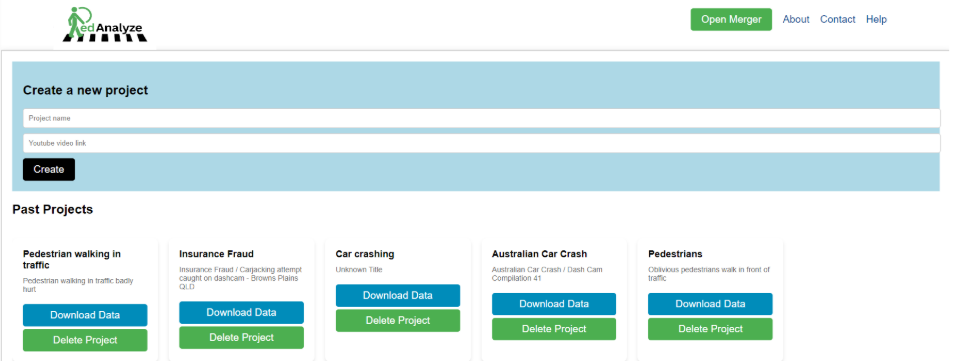

# 🧠 PedAnalyze‑Web: Web-Based Pedestrian Behavior Annotation Tool


**PedAnalyze-Web** is a web-based interface for the PedAnalyze tool, designed to streamline the annotation and analysis of pedestrian behavior in dash-cam videos. It is built to support autonomous vehicle research. It enables researchers, developers, and data scientists to create structured datasets with pre-defined tags for pedestrian and vehicle interactions, capturing critical scenarios like accidents or near-misses. With support for single-frame and multi-frame annotations, PedAnalyze-Web reduces redundancy and enhances temporal relationship analysis, making it a valuable tool for advancing safer autonomous driving systems.

> This project complements the [PedAnalyze](https://github.com/AugmentedDesignLab/ped-behavior-annotator) system, enabling researchers, traffic analysts, and AV developers to create high-quality behavior datasets for intelligent systems.

---
## 📖 Documentation:  
For full usage, setup, and annotation guidelines, visit:  
👉 [https://pedanalyze.readthedocs.io/en/latest/](https://pedanalyze.readthedocs.io/en/latest/)

---

## 🌐 Live Web View:
Check this project out at https://pedanalyze-web.vercel.app/

---

## 🖼 Preview:  


---

## 📸 Key Features

- 🎥 **Video Integration**: Load videos from local files or YouTube URLs.
- ⏱ **Precise Frame Control**: Use a slider and timestamp input for frame-level accuracy.
- 🏷 **Behavioral Tagging**: Add structured tags for pedestrians, vehicles, and environmental context.
- 📓 **Custom Notes**: Add rich descriptions or scene observations.
- 💾 **JSON Export**: Save annotations in a clean JSON format, ready for modeling or evaluation.
- 🌐 **Web-First UI**: Built with React for smooth interaction and low-latency annotation sessions.

---

## 🧰 Use Cases

- 🚦 Annotating pedestrian interactions in traffic surveillance footage
- 🤖 Creating training data for behavior prediction in autonomous vehicle systems
- 🧍 Studying human movement, attention, and trajectory in urban settings
- 🧪 Generating fine-grained datasets for ML model evaluation and simulation environments

---

## ⚙️ Installation

### Option 1: Run with Docker (Recommended)

```bash
git clone https://github.com/PedSim/pedanalyze-web.git
cd pedanalyze-web
docker build -t pedanalyze-web .
docker run -p 3000:3000 pedanalyze-web
```

### Option 2: Local Development
```bash
git clone https://github.com/PedSim/pedanalyze-web.git
cd pedanalyze-web
npm install
npm start
```
---

## 📚 Citation
If you use this tool for academic purposes, please cite the following

```bibtex
@inproceedings{inproceedings,
author = {Huang, Taorui and Muktadir, Golam Md and Sripada, Srishti and Saravanan, Rishi and Yuan, Amelia and Whitehead, Jim},
year = {2024},
month = {03},
pages = {},
title = {PedAnalyze - Pedestrian Behavior Annotator and Ontology},
doi = {10.1109/IV55156.2024.10588755}
}
```
This is our ongoing work identifying the archetypes using this tool: 

```bibtex
@inproceedings{inproceedings,
author = {Muktadir, Golam Md and Huang, Taorui and Bansal, Ritvik and Gaidhani, Namita and Jubaer, S M and Lin, Michael and Whitehead, Jim},
year = {2025},
month = {03},
pages = {},
title = {Pedestrian Archetypes - The Must-Have Pedestrian Models for Autonomous Vehicle Safety Testing}
}
```
---

## 📬 Contact

We’d love to hear from you!  
If you have any questions, feature requests, or want to contribute, feel free to reach out via:
- 📧 **Email**: [taoruih@gmail.com](mailto:taoruih@gmail.com)
